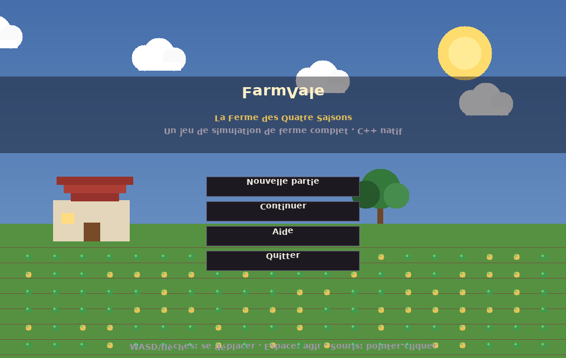
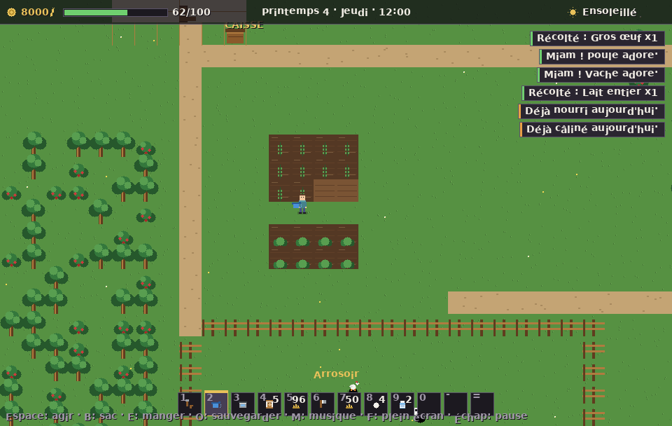
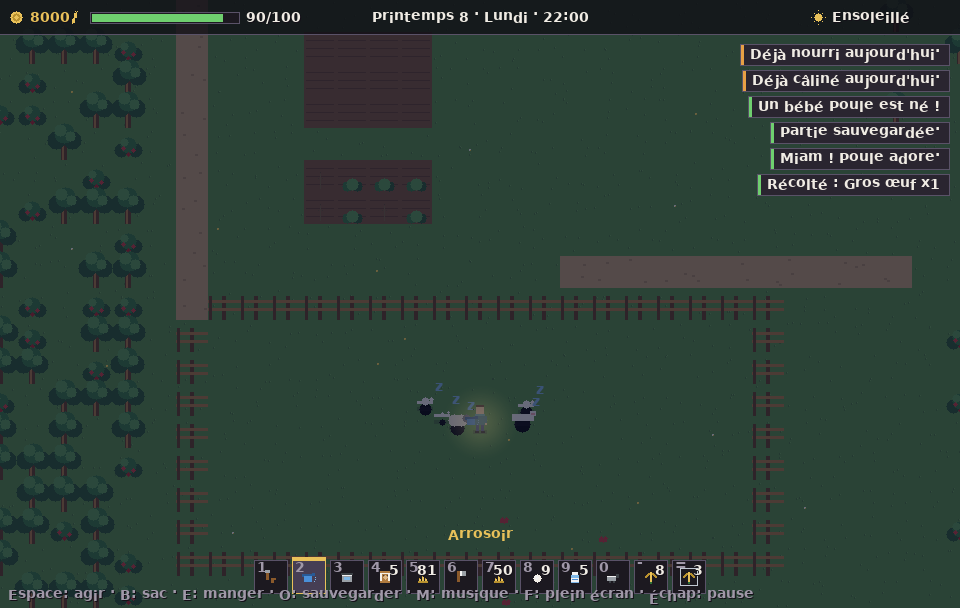
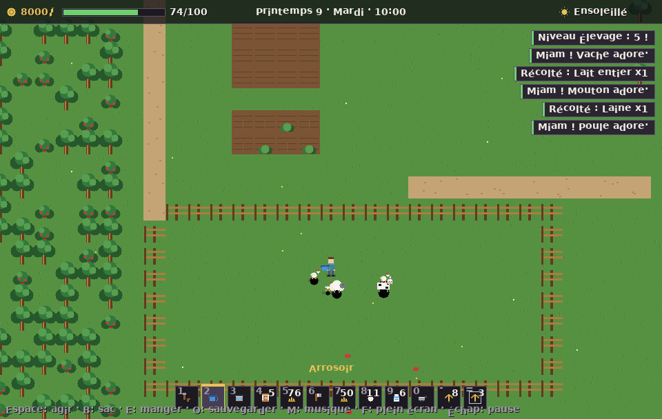
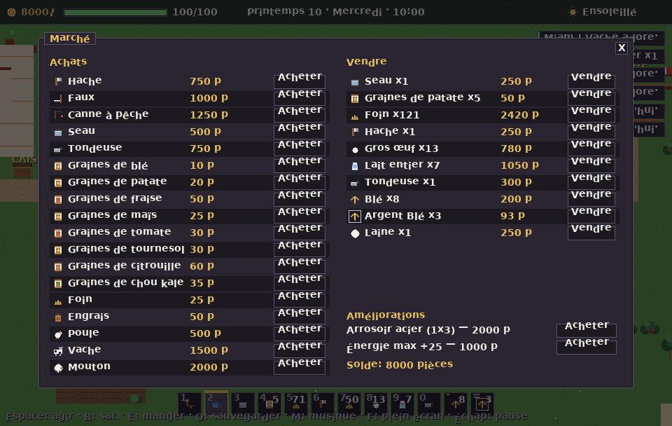
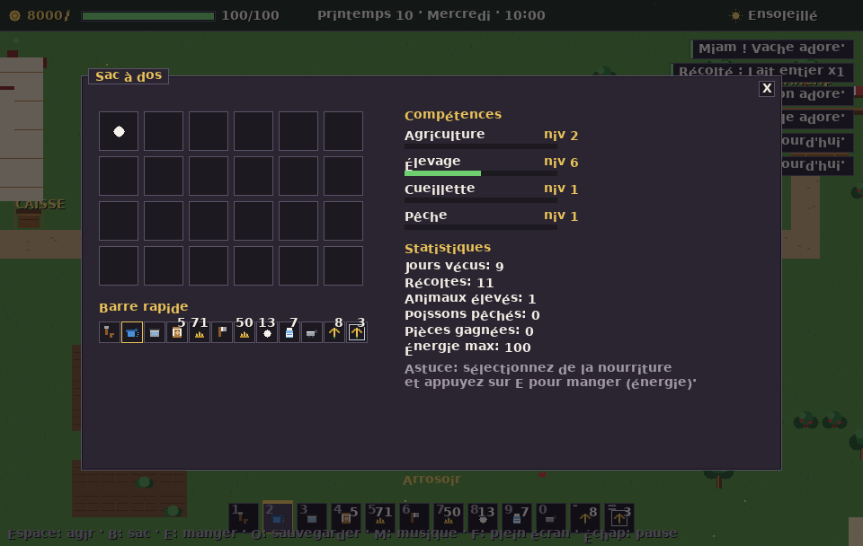
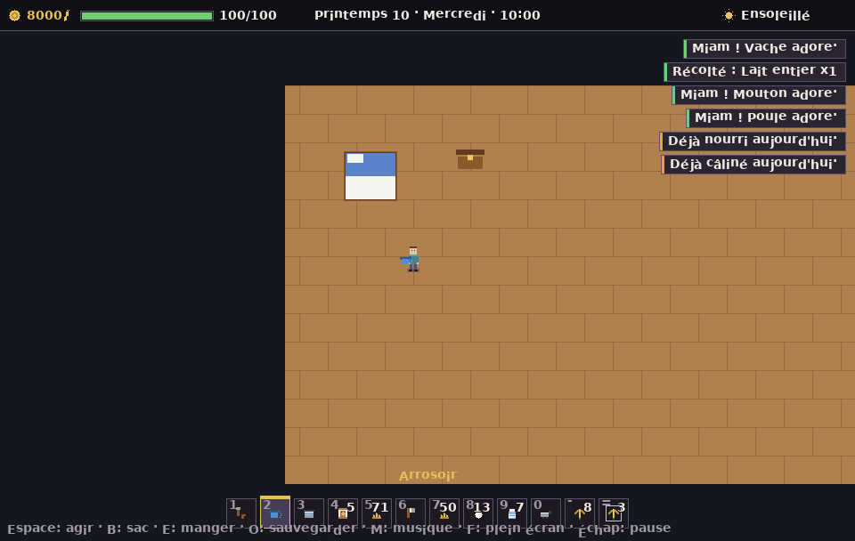

# 🌾 FarmVale — La Ferme des Quatre Saisons

Jeu de **simulation de ferme complet en C++ natif** (aucune dépendance
externe, moteur 100 % maison : rendu logiciel, audio synthétisé, UI en français).
Conçu pour être **vendu sur Steam** (ou ailleurs).



---

## ✨ Fonctionnalités

| Domaine | Contenu |
|---|---|
| **Cultures** | 8 cultures (blé, pomme de terre, fraise, maïs, tomate, tournesol, citrouille, chou kale) avec stades de croissance, arrosage, engrais, repousse (fraise/maïs/tomate), qualité Normal/Argent/Or (×1 / ×1,25 / ×1,5) |
| **Élevage** | Poules, vaches, moutons : amitié, bonheur, nourriture quotidienne, caresses, production (œuf, lait, laine), **reproduction** (2 adultes, amitié ≥ 60 → bébé), vente |
| **Outils** | Houe, arrosoir (upgrade 3×1 puis 3×3), hache, faux (foin), canne à pêche, seau, tondeuse |
| **Compétences** | Agriculture, Élevage, Cueillette, Pêche — 10 niveaux chacune |
| **Temps & saisons** | 1 h de jeu = 12 s réelles, journée 6 h → 2 h, dormir dans le lit ou évanouissement à 2 h, **4 saisons × 28 jours** |
| **Météo** | Soleil, nuage, pluie (arrose automatiquement), orage (éclairs), neige |
| **Économie** | Boutique (achat/vente, animaux, améliorations), caisse d'expédition (vente instantanée), qualités × prix |
| **Quêtes** | 3 quêtes par jour avec récompenses pièces + XP |
| **Mini-jeux** | Pêche à l'étang (gardon, truite, carpe, brochet), cueillette (arbres → bois, buissons → baies) |
| **Maison** | Intérieur avec lit (dormir) et coffre de 24 slots |
| **Succès** | 8 succès prêts pour Steam (voir `steam/README_STEAM.md`) |
| **Sauvegarde** | Sauvegarde/chargement texte + **autosave au coucher** |
| **UI** | Écran titre, pause, aide, réglages, muet, plein écran, inventaire 24 slots + barre rapide 12 slots |
| **Audio** | SFX synthétisés + musique générative (pas de fichiers requis) |

## 🎮 Contrôles

| Touche | Action |
|---|---|
| `Z Q S D` / flèches | Se déplacer |
| `Espace` | Agir (planter, arroser, récolter, parler, pêcher…) |
| `B` | Ouvrir le sac |
| `E` | Manger (restaure l'énergie) |
| `O` | Sauvegarder |
| `M` | Couper la musique |
| `F` | Plein écran |
| `Échap` | Pause / fermer les menus |
| `1…0, -, =` | Barre rapide |
| Souris | Pointer-cliquer (menus, inventaire, boutique) |

## 🛠️ Compilation

### Linux (natif, X11)
```sh
make            # compile build/farmvale (nécessite libX11 — headers auto-téléchargés)
./build/farmvale
```
> Sur une machine avec les paquets de dev : `sudo apt install libx11-dev`
> (sinon le Makefile télécharge les en-têtes officiels tout seul).

### Windows (build de distribution)
```bat
:: Option A — MinGW-w64 installé sur ta machine Windows :
build_windows.bat

:: Option B — cross-compilation depuis Linux (Zig, rien d'autre à installer) :
pip install ziglang
make windows     # produit build/FarmVale.exe (100 % autonome, pas de DLL à embarquer)
```
> Option C — MSVC/Visual Studio : `cmake -B build -S . && cmake --build build --config Release`

### Tests & outils
```sh
make test       # 58 vérifications du moteur de simulation (0 échec)
make headless   # build sans fenêtre (CI / captures d'écran)
./build/farmvale_headless --bot 9 --shots screenshots/shot_   # 10 captures de démonstration
python3 tools/gen_art.py    # génère les capsules Steam dans steam/
```

## 🧱 Architecture

```
src/
  core/       Moteur de simulation pur (temps, saisons, météo, cultures,
              animaux, économie, quêtes, sauvegarde) — testé unitairement
  engine/     Rendu logiciel (framebuffer 960×608), audio synthétisé,
              police bitmap générée, icônes vectorielles
  game/       Boucle de jeu, rendu du monde, UI, menus, succès
  platform/   Backends : X11 (Linux), Win32 (Windows/Steam), headless (CI)
  main.cpp    Point d'entrée commun
tools/        Génération police + artworks Steam + fetch en-têtes X11
tests/        58 tests du core (make test)
steam/        Artworks + guide Steam Direct (100 $, SDK, succès, SteamPipe)
```

**Zéro bibliothèque externe** : le jeu ne dépend que de la libc++ et de
libX11 (Linux) / des API système (Windows).

## 🚀 Publication Steam

Tout est préparé : artworks (`steam/*.png`), guide complet
(`steam/README_STEAM.md`), script SteamPipe (`steam/app_build.vdf`),
8 succès prêts à déclarer. Il te reste à :

1. **Créer ton compte Steam Direct** (taxe unique 100 $) sur https://partner.steamgames.com
2. **Télécharger le Steamworks SDK** et activer les succès (5 min, voir le guide)
3. **Uploader le build** avec SteamPipe (voir `steam/README_STEAM.md` §7)
4. Remplacer les artworks générés par tes illustrations finales (mêmes tailles)

## ✅ Tâches manuelles restantes (pour toi)

Le code est complet et testé. Ce qui ne peut pas être fait ici :

- [ ] **Compte Steam / Steam Direct (100 $)** et déclaration des 8 succès
- [ ] **Artworks finaux** professionnels (les `steam/*.png` sont des
      visuels générés automatiquement — remplace-les par tes illustrations)
- [ ] **Bande-annonce** (30–60 s) — les captures `screenshots/shot_*.png` peuvent servir
- [ ] **Modèles 3D / animations** (optionnel) : le jeu est en 2D pixel-art
      dessiné procéduralement ; si tu veux de la 3D, c'est un autre moteur
- [ ] **Test sur ta machine Windows** : `build_windows.bat` puis lancer l'exe
- [ ] **Traduction anglaise** de l'UI (le code est prêt : toutes les chaînes
      passent par des constantes dans `src/game/`)

## 📸 Captures

| | | |
|---|---|---|
|  |  |  |
|  |  |  |

## 📄 Licence

Projet indépendant — code et assets générés libres d'utilisation.
